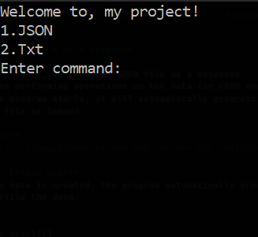
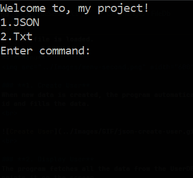
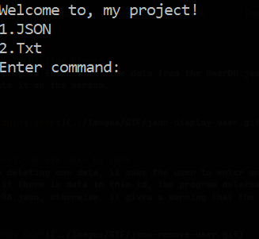
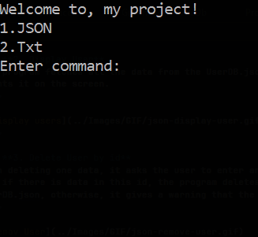
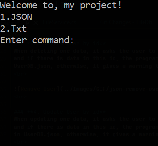
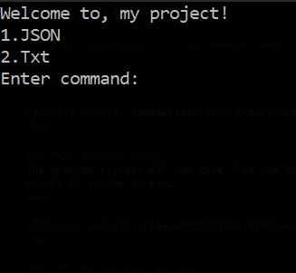

# Using a JSON file as a database.

In this project, we used the JSON file as a database
view when performing operations on the data (ie CRUD operations).
When the program starts, it will automatically generate UserDB.json,
if this file is loaded.

## **Menu**

---

### **1. Create User**
When new data is created, the program automatically creates an 
id and fills the data.
 

 

### **2. Display User**
The program fetches all the data from the UserDB.json file and 
prints it on the screen.
 

 

### **3. Delete User by id**
When deleting one data, it asks the user to enter an id,
and if there is data in this id, the program deletes it from
UserDB.json, otherwise, it gives a warning that the data is loaded.
 

 

### **4. Update User by id**
When updating one data, it asks the user to enter the id and name,
and if there is data in this id, the program updates the data
in UserDB.json, otherwise, it gives a warning that the data is loaded.
 

 

---

### **5. File Size**
json and txt files are used as database in our project,
in this section you can find out how much space the data takes up.
 

 

---

### **0. Exit**
In this section, we can see the program complete its work.
 

 
