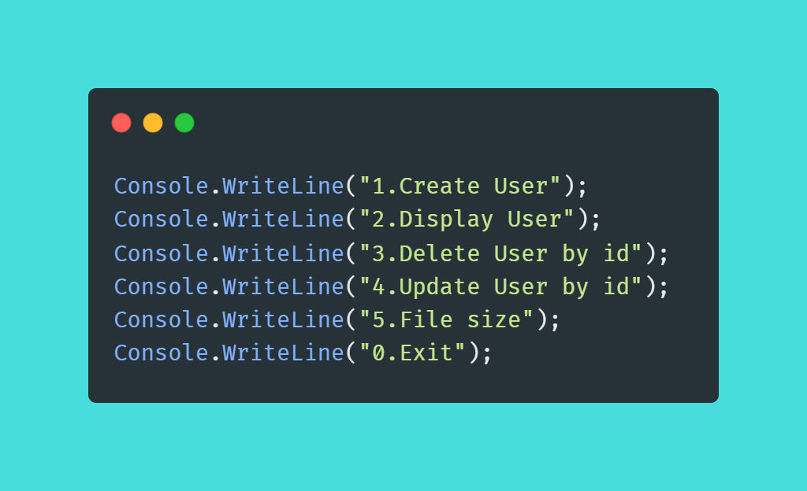

# Using a TXT file as a database.

In this project, we used the JSON file as a database
view when performing operations on the data (ie CRUD operations).

## **Menu**

### **1. Create User**
### **2. Display User**
### **3. Delete User by id**
### **4. Update User by id**
### **5. File Size**
### **0. Exit**
