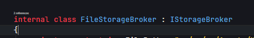
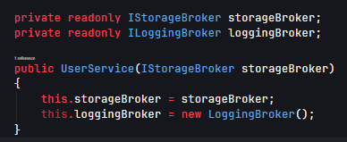

# Using the Dependency Injection design pattern in the project.
In this project, we used Dependency Injection Design Patterns to
perform operations on data.

In my ``FileDb`` project, I solved various problems by referring to a 
single ``IUSerService`` class to ``.json or .txt`` files through ``Dependency Injection``.

If you look closely, ``Dependency Injection (DI)`` is a software design pattern that
allows you to develop loosely coupled code. Through DI, you can reduce the hard 
coupling between software components. It is also known as ``Inversion-of-Control``,
which makes unit testing convenient.

It's important to take a step back to the basics of object-oriented application 
design, where loose coupling is a key design aspect. This means that objects have
only as many dependencies as they need to do their job, and the number of dependencies 
should be limited.
 

### **For Example Code**
 

``JSONStorageBroker.cs`` is implemented from the ``IStorageBroker.cs`` interface.
 

 

``FileStorageBroker.cs`` is implemented from the ``IStorageBroker.cs`` interface.
 

``JSONStorageBroker.cs`` is implemented from the ``IStorageBroker.cs`` interface.
 

When communicating with external technologies in our program, we refer to ``Service`` classes. 
Here you can see the ``IUserService.cs`` interface, which contains the common business logic
for ``JSON`` and ``TXT`` brokers, which have their own logic in the Broker layer.
 

 

We created an interface called ``IStorageBroker`` and implemented two classes,
``JsonStorageBroker.cs`` and ``TxtStorageBroker.cs``, both of which inherit from this interface.
By using the ``IStorageBroker`` interface as a parameter in the constructor of the 
``UserService`` class, users can choose which storage format they prefer to store their
data without changing the code.
