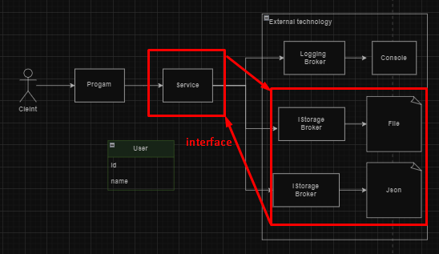

# Using the Dependency Inversion design pattern in the project.
In this project, we used Dependency Inversion Design Patterns to
perform operations on data.

The ``Dependency Inversion Principle (DIP)`` states that a high-level class
must not depend upon a lower-level class. They must both depend upon 
abstractions. And secondly, an abstraction must not depend upon details,
but the details must depend upon abstractions. 
 

Let's see the application of ``Dependency Inversion`` in our ``FileDb`` 
project with a code example.
 

### **For Example Code**
 

``IUserService'' implements ``IStorageBroker.cs'' interfaces.
 

 

FileDb loyhamizda ``Dependency Inversion`` ni ``Broker`` va ``Service`` qatlamlar 
bog'liqlikda kuzatsak bo'ladi. Yani ``IStorageBroker.cs`` va ``IUserService.cs`` 
interfeyslari orqali biz ikkala qatlam bo'lgan bo'g'liqlikni interfeysga 
yuklab qo'ydik. Biz endi ``Broker`` qavatida biror bir'o'zgarish qilisak 
``Service``da o'zgarish qililmaydi, ayni shu yerda ``Dependency Inversion``
tamoili dasturimizni tuzilishini yanada samarali tozalash yordam beradi.