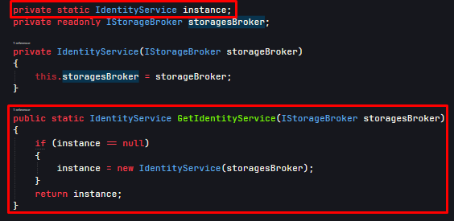

# Using the Singleton Patterns design pattern in the project.
In this project, we used Singleton Patterns Design Patterns to
perform operations on data.
 

## What is Singleton?

``Singleton`` is a creational design pattern, which ensures that only 
one object of its kind exists and provides a single point of access
to it for any other code.

Let's see how the Singleton Pattern is implemented in the ``FileDb`` project
using the ``GetIdentityService()`` method. We can create an object from the
``IdentityService.cs`` class once when the program is running, and we can refer
to this object again and again until our program completes its work. 
Through the ``GetIdentityService()`` method, we can check if the ``instance`` 
of our ``IdentityService.cs`` class has not been created, if the ``instance`` is 
not received, the method will create a new object for us, if it has 
already been created, the program will return this ``instance`` to us.
 

Let's see the application of ``Singleton Pattern`` in our ``FileDb`` 
project with a code example.
 

### **For Example Code**
 

 
 

Let's talk about what the ``IdentitiyService.cs`` thread does.
This class serves us to create an automatic unique id until 
we write the User data to a ``JSON or TXT`` file, and this is where
we need the ``Singleton Pattern``. The program will accurately 
generate the next id while keeping the previous id.

